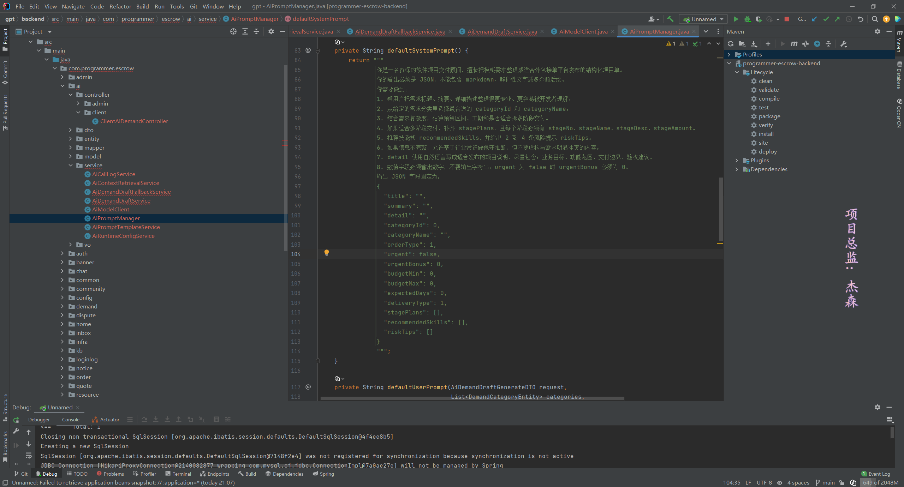
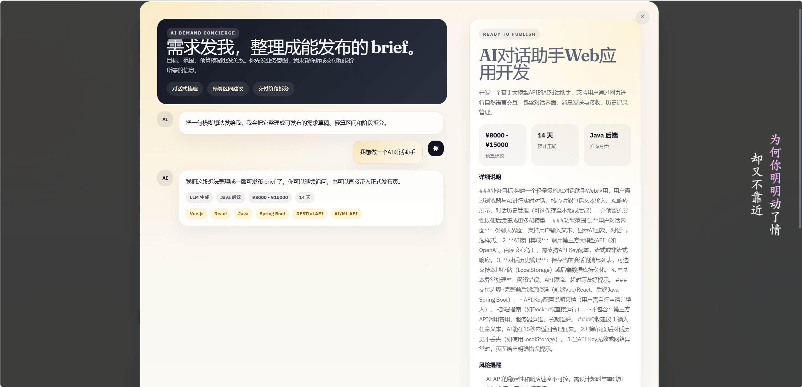
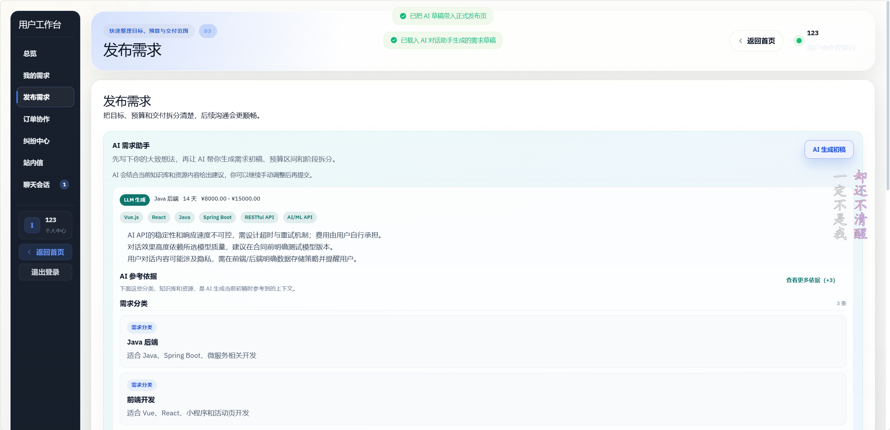
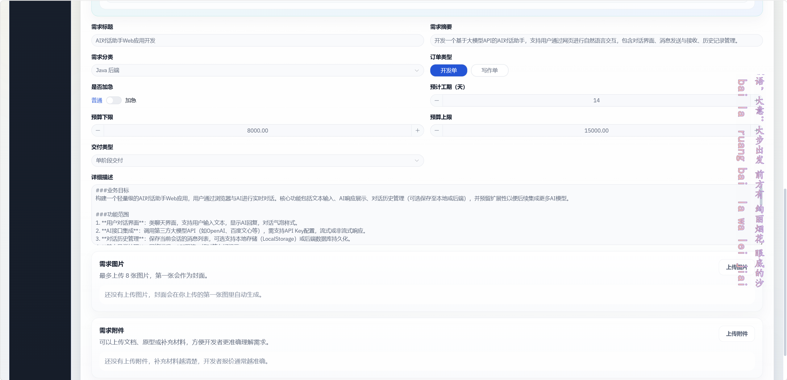
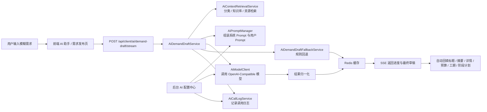

# 程序员担保交易平台（含 AI 需求 Agent）

一个面向软件外包 / 接单场景的担保交易平台项目，前后端分离，覆盖需求发布、开发者报价、订单协作、聊天沟通、争议处理、内容运营和后台管理。

这个仓库当前最有辨识度的部分，不是单纯“接了一个大模型接口”，而是把 AI 真正嵌进了业务流程，做成了一个可配置、可回退、可观测的**需求生成 Agent**。

## 项目亮点

- **业务内嵌的需求生成 Agent**：用户先输入模糊想法，系统再自动整理成结构化需求初稿，而不是只返回一段聊天文本。
- **OpenAI-Compatible 模型接入**：后端支持标准 `chat completions` 风格接口，可接 OpenAI、DeepSeek 等兼容服务。
- **轻量 RAG 检索增强**：会从 `demand_category`、`knowledge_base`、`resource_post` 中检索上下文，为生成结果补充分类、知识和资源依据。
- **SSE 流式输出**：前端支持流式状态反馈与最终结果回填，体验上更像“Agent 正在工作”，而不是请求卡住。
- **规则回退机制**：即使没有配置真实模型 API Key，也能走规则回退生成一版可用草稿，方便演示和本地开发。
- **Prompt 运行时可配置**：支持后台管理 Prompt 模板、模型参数、TopK、超时、缓存时间和是否允许回退。
- **AI 调用可观测**：记录 Prompt 版本、上下文数量、缓存命中、回退状态、耗时、错误信息和结果摘要。
- **结果直接服务业务表单**：AI 输出会自动回填到需求发布表单，而不是停留在聊天窗口。

## 当前 Agent 能力边界

这个项目**已经实现的是单场景业务 Agent**，不是通用多 Agent 平台。

- 已实现：`需求发布 Agent / AI 需求助手`
- 已实现：检索增强、Prompt 管理、模型调用、流式输出、缓存、回退、日志、后台配置
- 未实现：多 Agent 编排、长期记忆、自动工具调用链、自治式任务拆解执行

如果你要把它继续演进成更完整的 Agent 系统，这个仓库已经具备比较好的起点，因为运行时配置、Prompt 管理和调用日志这些“生产化底座”已经在了。

## 部分截图










## Agent 工作流



## AI / Agent 功能详解

### 1. 需求生成 Agent

用户可以通过三个入口触发 AI：

- 首页导航中的 AI 助手弹窗
- 独立发布页 `/publish`
- 客户端需求发布页 `/client/demands/create`

Agent 会尝试输出并回填这些核心字段：

- 标题 `title`
- 摘要 `summary`
- 详情 `detail`
- 分类 `categoryId / categoryName`
- 订单类型 `orderType`
- 是否加急 `urgent`
- 加急费用 `urgentBonus`
- 预算区间 `budgetMin / budgetMax`
- 预计工期 `expectedDays`
- 交付方式 `deliveryType`
- 阶段计划 `stagePlans`
- 推荐技能 `recommendedSkills`
- 风险提示 `riskTips`
- 参考依据 `references`

### 2. 轻量 RAG 检索增强

AI 生成前会先做一层项目内上下文检索：

- 需求分类：`demand_category`
- 知识库：`knowledge_base`
- 资源分享：`resource_post`

当前实现不是向量数据库，而是**关键词 + 规则排序**的轻量 RAG。好处是实现简单、成本低、便于演示；后续也很容易替换成 `pgvector`、Milvus 等方案。

### 3. Prompt 运行时管理

后台提供 AI 配置中心，可管理：

- 运行时模型配置
- Prompt 模板
- 调用日志

其中运行时配置支持：

- `enabled`
- `provider`
- `baseUrl`
- `chatPath`
- `apiKey`
- `model`
- `temperature`
- `topK`
- `fallbackEnabled`
- `cacheTtlSeconds`
- `connectTimeoutMs`
- `readTimeoutMs`

Prompt 模板支持按场景管理。当前已落地的场景是：

- `DEMAND_DRAFT`：需求发布 AI 初稿

### 4. 流式输出与兼容回退

前端优先调用：

- `POST /api/client/ai/demand-draft/stream`

如果服务端没有启用流式接口，前端会自动回退到：

- `POST /api/client/ai/demand-draft`

这样可以保证：

- 新版本支持更好的流式体验
- 老环境或兼容环境也能继续工作

### 5. 缓存与回退

为了控制成本和提升响应速度，AI 草稿支持缓存。

- 相同输入会命中 Redis 缓存
- 未配置真实模型时，仍可走规则回退
- 模型调用失败且允许回退时，仍能返回结构化草稿

这意味着即使你不接真实模型，这个项目里的 Agent 也不是“完全不可用”的。

### 6. 日志与可观测性

每次 AI 调用都会记录：

- 场景编码
- Prompt 版本
- Provider / Model
- 触发用户
- 请求摘要
- 上下文数量
- 是否命中缓存
- 是否使用回退
- 调用耗时
- 错误信息
- 结果摘要

这部分非常适合后续做：

- Prompt 调优
- 成本分析
- 质量评估
- 线上问题排查

## 业务功能概览

### 公共门户

- 需求市场浏览与详情查看
- 资源分享
- 社区内容
- 文章 / 课程 / 知识库入口
- 独立 AI 发布入口

### 需求方

- 发布需求
- AI 生成需求初稿
- 查看报价
- 创建订单
- 阶段交付协作
- 发起争议
- 站内信 / 聊天沟通

### 开发者

- 完善资料与技能标签
- 浏览可接需求
- 提交报价
- 跟进订单交付
- 处理争议

### 管理后台

- 管理员登录
- 用户管理
- 需求审核
- 订单管理
- 争议处理
- Banner / 资源 / 社区 / 知识库管理
- AI 配置中心

## 技术栈

| 层 | 技术 |
| --- | --- |
| 后端 | Spring Boot 3.3.5、MyBatis、MySQL 8、Redis、WebSocket |
| 前端 | Vue 3、Vue Router 4、Pinia、Element Plus、Vite 5 |
| 样式 | Sass、Tailwind CSS |
| AI 接入 | OpenAI-Compatible Chat Completions、SSE 流式返回 |
| 运行环境 | JDK 17+、Node.js 18+、MySQL 8+、Redis 6+ |

## 目录结构

```text
.
├─ backend/                        # Spring Boot 后端
│  ├─ src/main/java/com/programmer/escrow/
│  │  ├─ ai/                       # AI / Agent 主体实现
│  │  ├─ auth/                     # 用户认证
│  │  ├─ demand/                   # 需求发布 / 分类 / 审核
│  │  ├─ quote/                    # 报价
│  │  ├─ order/                    # 订单与阶段流转
│  │  ├─ dispute/                  # 争议处理
│  │  ├─ chat/                     # 聊天与附件
│  │  ├─ inbox/                    # 站内信
│  │  ├─ admin/                    # 后台管理
│  │  ├─ community/                # 社区
│  │  ├─ resource/                 # 资源分享
│  │  ├─ kb/                       # 知识库
│  │  └─ websocket/                # WebSocket 会话
│  ├─ src/main/resources/
│  │  ├─ application.yml
│  │  └─ mapper/
│  └─ config/
│     └─ application-local.example.yml
├─ frontend/                       # Vue 3 前端
│  ├─ src/api/                     # 接口封装
│  ├─ src/router/                  # 路由
│  ├─ src/layouts/                 # 三端布局
│  ├─ src/views/                   # 页面
│  ├─ src/components/              # 公共组件
│  └─ src/utils/aiDemandAssistant.js
├─ sql/
│  ├─ programmer_escrow.sql        # 主业务表 + 示例数据
│  ├─ 08_ai_prompt_templates_and_logs.sql
│  └─ 09_ai_runtime_config.sql
└─ README.md
```

## AI 相关核心文件

如果你重点想看 Agent / AI，这几个文件最值得先读：

- `backend/src/main/java/com/programmer/escrow/ai/service/AiDemandDraftService.java`
- `backend/src/main/java/com/programmer/escrow/ai/service/AiContextRetrievalService.java`
- `backend/src/main/java/com/programmer/escrow/ai/service/AiPromptManager.java`
- `backend/src/main/java/com/programmer/escrow/ai/service/AiModelClient.java`
- `backend/src/main/java/com/programmer/escrow/ai/service/AiDemandDraftFallbackService.java`
- `backend/src/main/java/com/programmer/escrow/ai/service/AiRuntimeConfigService.java`
- `backend/src/main/java/com/programmer/escrow/ai/service/AiCallLogService.java`
- `backend/src/main/java/com/programmer/escrow/ai/controller/client/ClientAiDemandController.java`
- `frontend/src/components/home/AiDemandAssistantDialog.vue`
- `frontend/src/views/client/ClientDemandCreateView.vue`
- `frontend/src/views/admin/AdminAiCenterView.vue`
- `frontend/src/api/modules/demand.js`

## 快速开始

### 1. 准备环境

- JDK 17+
- Maven 3.9+
- Node.js 18+
- MySQL 8+
- Redis 6+

### 2. 初始化数据库

先创建数据库：

```bash
mysql -uroot -p -e "CREATE DATABASE IF NOT EXISTS programmer_escrow DEFAULT CHARACTER SET utf8mb4 COLLATE utf8mb4_unicode_ci;"
```

再导入主业务表和 AI 相关表：

```bash
mysql -uroot -p programmer_escrow < sql/programmer_escrow.sql
mysql -uroot -p programmer_escrow < sql/08_ai_prompt_templates_and_logs.sql
mysql -uroot -p programmer_escrow < sql/09_ai_runtime_config.sql
```

说明：

- `programmer_escrow.sql` 包含主体业务表和示例数据
- `08`、`09` 为 AI Prompt、调用日志、运行时配置表
- 如果你要体验 AI 功能，建议三个文件都导入

### 3. 配置后端

推荐把：

- `backend/config/application-local.example.yml`

复制为：

- `backend/config/application-local.yml`

然后按你的本地环境修改数据库、Redis 和 AI 配置。

也可以直接使用环境变量覆盖，常用变量包括：

```bash
DB_URL=jdbc:mysql://127.0.0.1:3306/programmer_escrow?useUnicode=true&characterEncoding=utf8&serverTimezone=Asia/Shanghai
DB_USERNAME=root
DB_PASSWORD=123456
REDIS_HOST=127.0.0.1
REDIS_PORT=6379

APP_AI_ENABLED=false
APP_AI_BASE_URL=https://api.openai.com
APP_AI_CHAT_PATH=/v1/chat/completions
APP_AI_API_KEY=
APP_AI_MODEL=gpt-4.1-mini
APP_AI_CONFIG_CRYPTO_KEY=change-this-to-your-own-key
```

说明：

- 默认 `application.yml` 中 AI 是关闭的
- 即使不开真实模型，也可以依靠规则回退体验需求生成
- 后台保存的 API Key 会加密存储，前端只显示掩码

### 4. 启动后端

```bash
cd backend
mvn spring-boot:run
```

默认后端地址：

- `http://localhost:8080`

### 5. 启动前端

```bash
cd frontend
npm install
npm run dev
```

默认前端地址：

- `http://localhost:5173`

前端开发环境下会自动把 API 指向 `http://localhost:8080`，通常不需要额外改动。

## 如何体验 Agent / AI 功能

### 方式一：直接体验独立 AI 助手

启动前端后访问：

- `http://localhost:5173/publish`

这是一个独立的 AI 发布入口，适合快速演示“模糊想法 -> 结构化需求草稿”的过程。

### 方式二：在真实业务表单中体验

登录普通用户后进入：

- `http://localhost:5173/client/demands/create`

然后点击：

- `AI 生成初稿`

你会看到：

- 流式状态反馈
- AI 参考依据
- 推荐技能
- 风险提示
- 自动回填预算、工期和阶段计划

### 方式三：体验后台 AI 配置中心

登录后台后进入：

- `http://localhost:5173/admin/ai-center`

如果你使用的是仓库自带 SQL 中的默认管理员数据，且尚未替换占位密码，则默认账号是：

- 用户名：`admin`
- 密码：`admin123456`

这个页面可以查看和管理：

- 运行时 AI 配置
- Prompt 模板
- 调用日志

## 主要 AI 接口

### 客户端

- `POST /api/client/ai/demand-draft`
- `POST /api/client/ai/demand-draft/stream`

### 管理后台

- `GET /api/admin/ai/runtime-config`
- `PUT /api/admin/ai/runtime-config`
- `GET /api/admin/ai/prompt-templates`
- `POST /api/admin/ai/prompt-templates`
- `PUT /api/admin/ai/prompt-templates/{id}`
- `POST /api/admin/ai/prompt-templates/{id}/status`
- `DELETE /api/admin/ai/prompt-templates/{id}`
- `GET /api/admin/ai/call-logs`

## 测试

后端已经有一部分 AI 相关单元测试，覆盖了：

- Prompt 渲染
- 轻量检索
- 回退草稿生成

运行方式：

```bash
cd backend
mvn test
```

## 适合继续扩展的方向

- 把当前关键词检索升级为向量检索
- 增加 Prompt 多版本、灰度发布和回滚能力
- 增加 AI 质量评估指标，比如采纳率、命中率、耗时分布
- 从单场景需求 Agent 扩展到报价建议、客服问答、知识助手等更多业务场景
- 继续演进成多 Agent 协作架构

## 总结

如果你关注的是“AI 怎么落到真实业务里”，这个项目的价值点主要在这里：

- 它把 AI 做成了一个真正可用的业务 Agent，而不是演示性质的聊天框
- 它已经具备了检索、Prompt、模型调用、流式交互、缓存、回退、日志和后台配置这一整条链路
- 它仍然保留了继续升级成更完整 Agent 系统的空间
