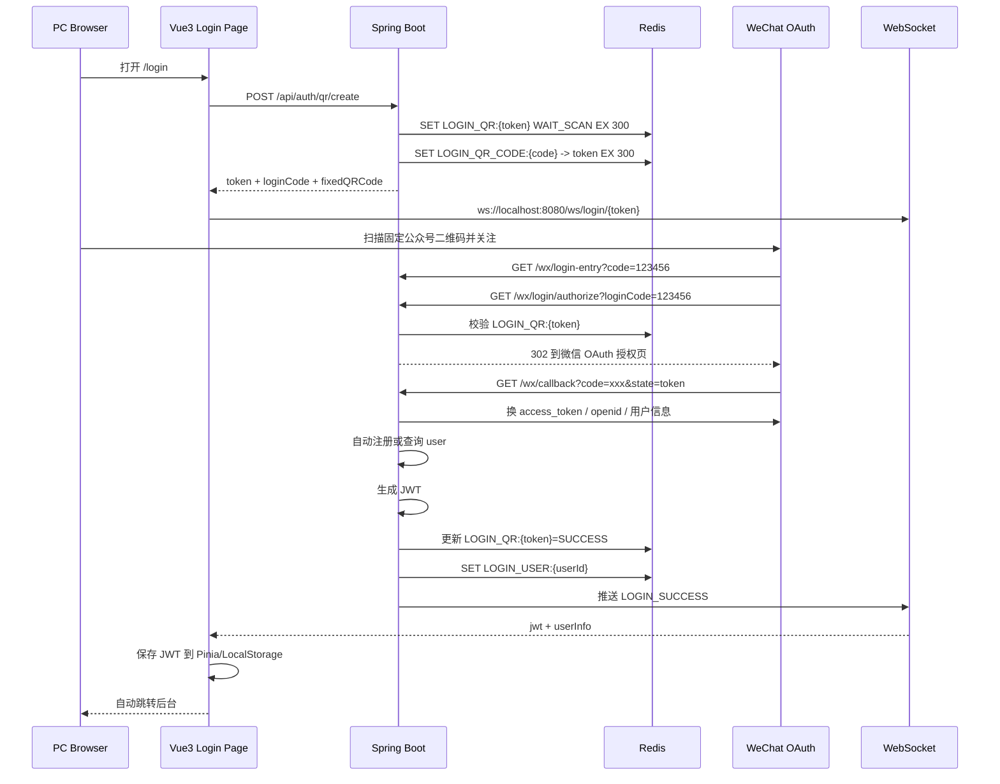
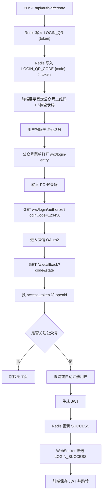

# 微信公众号扫码登录 PC 网站

## 1. 架构设计

### 1.1 核心目标

- PC 端生成一次性登录码，页面右侧展示固定公众号二维码和当前电脑的 6 位临时登录码。
- 用户在微信内打开扫码链接，经过公众号 OAuth2 授权后完成登录。
- 后端生成 JWT，写入 Redis 用户会话缓存，并通过 WebSocket 推送给 PC 端。
- 前端收到 `LOGIN_SUCCESS` 消息后落库 JWT、更新 Pinia、自动跳转工作台。

### 1.2 模块划分

```text
backend/
  src/main/java/com/programmer/escrow/
    auth/
      controller/
      model/
      service/
      util/
      vo/
    config/
    loginlog/
      entity/
      mapper/
    security/
      model/
    wechat/
      controller/
      model/
      service/
    websocket/
    user/
      entity/
      mapper/
    common/
      api/
      constant/
      exception/
      util/

frontend/
  src/
    api/
      modules/
    composables/
    router/
    stores/
    views/
      Login.vue
```

### 1.3 登录时序图



### 1.4 接口流程图



## 2. 后端实现说明

### 2.1 关键入口

- `POST /api/auth/qr/create`
  文件：[QrAuthController.java](/G:/project/live%20diff/gpt/backend/src/main/java/com/programmer/escrow/auth/controller/QrAuthController.java)
- `GET /wx/login`
  文件：[WxLoginController.java](/G:/project/live%20diff/gpt/backend/src/main/java/com/programmer/escrow/wechat/controller/WxLoginController.java)
- `GET /wx/callback`
  文件：[WxLoginController.java](/G:/project/live%20diff/gpt/backend/src/main/java/com/programmer/escrow/wechat/controller/WxLoginController.java)
- JWT 安全链
  文件：[SecurityConfig.java](/G:/project/live%20diff/gpt/backend/src/main/java/com/programmer/escrow/config/SecurityConfig.java)
  文件：[JwtAuthenticationFilter.java](/G:/project/live%20diff/gpt/backend/src/main/java/com/programmer/escrow/security/JwtAuthenticationFilter.java)
  文件：[JwtUtil.java](/G:/project/live%20diff/gpt/backend/src/main/java/com/programmer/escrow/security/JwtUtil.java)
- WebSocket
  文件：[WebSocketConfig.java](/G:/project/live%20diff/gpt/backend/src/main/java/com/programmer/escrow/websocket/WebSocketConfig.java)
  文件：[LoginWebSocketSessionManager.java](/G:/project/live%20diff/gpt/backend/src/main/java/com/programmer/escrow/websocket/LoginWebSocketSessionManager.java)
- 微信接口
  文件：[WechatOfficialAccountService.java](/G:/project/live%20diff/gpt/backend/src/main/java/com/programmer/escrow/wechat/service/WechatOfficialAccountService.java)

### 2.2 Redis Key 设计

| Key | 示例 | TTL | 说明 |
|---|---|---:|---|
| `LOGIN_QR:{token}` | `LOGIN_QR:uuid` | 300s | 二维码登录状态机，状态从 `WAIT_SCAN -> SCANNED -> SUCCESS` |
| `LOGIN_QR_CODE:{code}` | `LOGIN_QR_CODE:125680` | 300s | 6 位 PC 登录码到二维码 token 的映射 |
| `LOGIN_QR_SCAN_LOCK:{token}` | `LOGIN_QR_SCAN_LOCK:uuid` | 90s | 扫码短锁，防止同一二维码被多设备并发抢占 |
| `LOGIN_USER:{userId}` | `LOGIN_USER:10001` | 与 JWT 同步 | 当前登录态快照，便于续期与审计 |
| `JWT_BLACKLIST:{jwt}` | `JWT_BLACKLIST:ey...` | 剩余 JWT 生命周期 | 注销或踢下线后立即失效 |
| `WECHAT:ACCESS_TOKEN` | `WECHAT:ACCESS_TOKEN` | 约 7080s | 缓存公众号全局 access_token，减少微信 API 压力 |

### 2.3 TTL 设计原则

- 登录二维码严格 5 分钟过期，减少截屏传播和暴力重放风险。
- 扫码锁只保留 90 秒，覆盖一次微信授权回跳窗口，避免设备长时间占坑。
- `LOGIN_USER:{userId}` 与 JWT 同寿命，保证续期和业务态一致。
- 黑名单按 JWT 剩余时间保存，过期后自动清理，无需额外回收任务。

### 2.4 防重复扫码与防复用

- 首次进入 `/wx/login` 时申请 `LOGIN_QR_SCAN_LOCK:{token}`，后续并发扫码会收到“处理中”。
- 登录成功后 `LOGIN_QR:{token}` 状态变为 `SUCCESS`，再次扫码直接视为已使用。
- 前端登录码到期自动刷新，新 token 和新 code 替代旧值，旧登录码自然失效。

### 2.5 JWT 安全体系

- 使用 `jjwt 0.12.6`，HS256 签名。
- `JwtAuthenticationFilter` 负责解析 Bearer Token、校验黑名单、注入 `SecurityContext`。
- `SecurityConfig` 配置无状态认证和接口权限。
- 续期策略：
  当 JWT 剩余有效期低于 `app.jwt.refresh-threshold-seconds` 时，后端自动下发 `X-Refresh-Token`。
- 黑名单策略：
  `/api/auth/logout` 将当前 JWT 写入 `JWT_BLACKLIST:{jwt}`，直到自然过期。

### 2.6 微信 OAuth 说明

- 本地默认开启 `app.wechat.mock-enabled=true`，可以直接用 mock 链路验证固定二维码 + 登录码流程。
- 生产环境将其改为 `false`，并配置真实的：
  - `app.wechat.app-id`
  - `app.wechat.app-secret`
  - `app.wechat.callback-url`
  - `app.wechat.login-entry-url`
  - `app.wechat.subscribe-url`
  - `app.wechat.official-account-qr-image-url`

## 3. 前端实现说明

### 3.1 页面与状态

- 登录页：
  文件：[Login.vue](/G:/project/live%20diff/gpt/frontend/src/views/Login.vue)
- Axios 封装：
  文件：[http.js](/G:/project/live%20diff/gpt/frontend/src/api/http.js)
- 认证接口：
  文件：[auth.js](/G:/project/live%20diff/gpt/frontend/src/api/modules/auth.js)
- Pinia 状态：
  文件：[auth.js](/G:/project/live%20diff/gpt/frontend/src/stores/auth.js)
- WebSocket 自动重连：
  文件：[useLoginWebSocket.js](/G:/project/live%20diff/gpt/frontend/src/composables/useLoginWebSocket.js)

### 3.2 前端行为

- 页面打开即调用 `/api/auth/qr/create`。
- 右侧展示固定公众号二维码图片和当前电脑 6 位登录码。
- 建立 `ws://localhost:8080/ws/login/{token}`。
- 收到 `LOGIN_SUCCESS` 后：
  - 保存 JWT 到 Pinia 与 `localStorage`
  - 更新用户信息
  - 跳转 `/client/home` 或 `/developer/home`
- 二维码过期后自动刷新并重连 WebSocket。

## 4. 数据库 SQL

### 4.1 用户表核心字段

```sql
CREATE TABLE `user` (
  `id` BIGINT NOT NULL AUTO_INCREMENT,
  `user_no` VARCHAR(32) NOT NULL,
  `openid` VARCHAR(64) DEFAULT NULL,
  `nickname` VARCHAR(64) NOT NULL,
  `avatar_url` VARCHAR(255) DEFAULT NULL,
  `created_at` DATETIME NOT NULL DEFAULT CURRENT_TIMESTAMP,
  PRIMARY KEY (`id`),
  UNIQUE KEY `uk_user_no` (`user_no`),
  UNIQUE KEY `uk_openid` (`openid`)
) ENGINE=InnoDB DEFAULT CHARSET=utf8mb4;
```

### 4.2 登录日志表

```sql
CREATE TABLE `login_log` (
  `id` BIGINT NOT NULL AUTO_INCREMENT,
  `user_id` BIGINT NOT NULL,
  `ip` VARCHAR(64) DEFAULT NULL,
  `login_time` DATETIME NOT NULL DEFAULT CURRENT_TIMESTAMP,
  `login_type` VARCHAR(32) NOT NULL,
  PRIMARY KEY (`id`),
  KEY `idx_user_time` (`user_id`, `login_time`),
  CONSTRAINT `fk_login_log_user_id` FOREIGN KEY (`user_id`) REFERENCES `user` (`id`)
) ENGINE=InnoDB DEFAULT CHARSET=utf8mb4;
```

## 5. 接口文档

### 5.1 创建登录二维码

- 请求地址：`POST /api/auth/qr/create`
- 请求参数：无
- 成功返回：

```json
{
  "code": 0,
  "msg": "success",
  "data": {
    "token": "6d90d19f-xxxx",
    "loginCode": "125680",
    "officialAccountQrImageUrl": "https://your-cdn/official-account-qr.png",
    "loginEntryUrl": "http://localhost:8080/wx/login-entry",
    "expireAt": "2026-05-15T08:05:00Z"
  }
}
```

- 状态码：
  - `200` 成功
  - `500` Redis 或服务异常

### 5.2 公众号登录入口页

- 请求地址：`GET /wx/login-entry?code={loginCode}`
- 请求参数：
  - `code`：可选，PC 端显示的 6 位登录码
- 返回：
  - HTML 输入页，用户在微信内输入当前电脑上的登录码

### 5.3 按登录码进入 OAuth

- 请求地址：`GET /wx/login/authorize?loginCode={code}`
- 请求参数：
  - `loginCode`：6 位登录码
- 返回：
  - 成功：`302` 跳转微信 OAuth
  - 失败：HTML 提示页

### 5.4 微信 OAuth 回调

- 请求地址：`GET /wx/callback`
- 请求参数：
  - `code`：微信授权码
  - `state`：二维码 token
- 业务结果：
  - 未关注公众号：`302` 到关注页
  - 已关注：写入 Redis、生成 JWT、推送 WebSocket、返回成功页

### 5.5 当前登录用户

- 请求地址：`GET /api/auth/me`
- 请求头：`Authorization: Bearer {jwt}`
- 成功返回：`LoginVO`

### 5.6 注销

- 请求地址：`POST /api/auth/logout`
- 请求头：`Authorization: Bearer {jwt}`
- 成功返回：

```json
{
  "code": 0,
  "msg": "success"
}
```

### 5.7 WebSocket

- 地址：`ws://localhost:8080/ws/login/{token}`
- 成功推送：

```json
{
  "type": "LOGIN_SUCCESS",
  "token": "qr-login-token",
  "jwt": "eyJhbGciOiJIUzI1NiJ9...",
  "userId": 10001,
  "nickname": "Mock WeChat User",
  "avatarUrl": "https://dummyimage.com/200x200/2563eb/ffffff&text=WX",
  "userType": 1,
  "roles": ["CLIENT"],
  "redirectPath": "/client/home"
}
```

## 6. 统一异常处理

统一响应结构：

```json
{
  "code": 500,
  "msg": "xxx",
  "message": "xxx"
}
```

已覆盖异常：

- token 失效
- 微信授权失败
- Redis 异常
- JWT 异常
- WebSocket 推送异常
- 参数校验异常

## 7. 上线配置清单

### 7.1 后端

在 [application.yml](/G:/project/live%20diff/gpt/backend/src/main/resources/application.yml) 中配置：

- `spring.datasource.*`
- `spring.data.redis.*`
- `app.jwt.secret`
- `app.wechat.app-id`
- `app.wechat.app-secret`
- `app.wechat.callback-url`
- `app.wechat.qr-entry-url`
- `app.wechat.subscribe-url`
- `app.wechat.mock-enabled=false`

### 7.2 前端

- 默认接口地址：`http://localhost:8080`
- 如需修改，设置 `VITE_API_BASE_URL`

## 8. 安全设计说明

- JWT 无状态认证，后端不保存 HttpSession。
- Redis 黑名单保证退出登录后 token 立刻失效。
- 二维码使用一次性 token，并通过短 TTL + 状态机控制生命周期。
- 固定公众号二维码只负责“进入公众号”，真正绑定当前 PC 会话的是 6 位临时登录码。
- WebSocket 以 `token` 粒度隔离会话，登录成功后立即关闭连接，避免长期占用。
- 微信全局 access_token 走 Redis 缓存，避免多实例并发刷新。

## 9. 高并发优化建议

- WebSocket 会话管理可升级为 Redis Pub/Sub 或 MQ 广播，支持多实例水平扩展。
- `LOGIN_QR:{token}` 可从 String JSON 迁移为 Redis Hash + Lua，进一步提升状态机原子性。
- 登录日志异步化：将 `login_log` 写入消息队列，削平高峰期数据库写压力。
- 微信接口增加超时、重试和熔断，防止外部依赖放大平台抖动。
- 前端主包已超过 500k，可按业务路由拆包，降低首屏加载时间。
